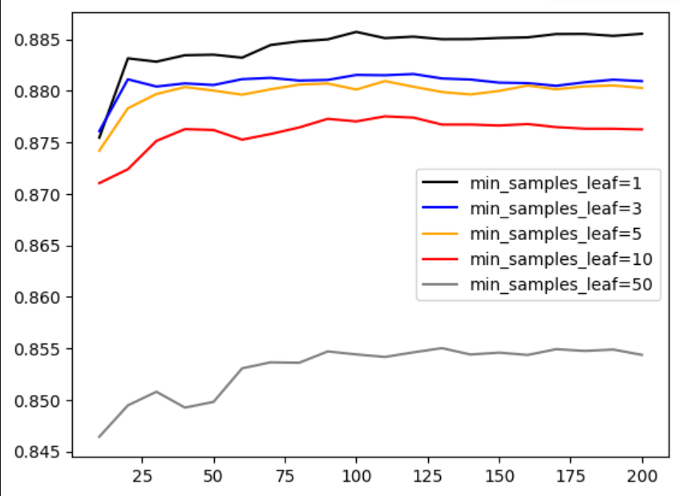
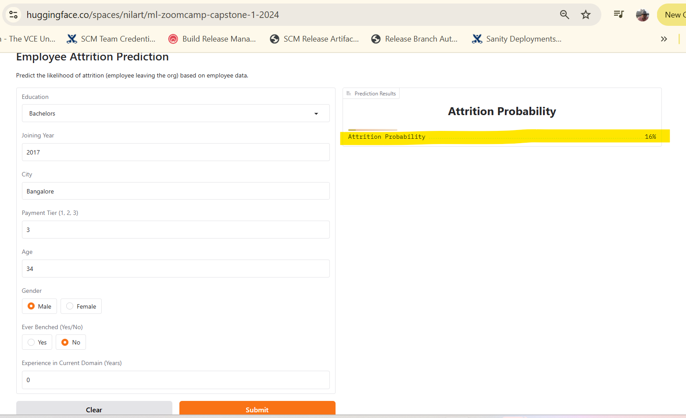

# ml-zoomcamp-capstone-1-2024
## Description
This is DataTalksClub [ML Zoomcamp](https://github.com/DataTalksClub/machine-learning-zoomcamp) capstone 1 project repo.

It uses simple employee dataset from IT industry (presumably from India). 
This model tries to predict if employee would leave the company in next 2 years. 

Dataset credit: https://www.kaggle.com/datasets/tejashvi14/employee-future-prediction

Here are step by step details about how we build optimal model to predict employee leaving probability. 

## 1. Data preparation, cleanup and EDA
Code here: [notebook.ipynb](./notebook.ipynb)

Parse downloaded dataset [Employee.csv](./Employee.csv) via `pandas`.

Note: We are using local dataset copy here but we can download data from kaggle in notebook as well.
```python
kagglehub.dataset_download("tejashvi14/employee-future-prediction")
```
Look for NAN values in data (There are none). 

Feature importance of rest features with our target variable: leaveornot:

We find mutual info for categorical features and correlation for numerical features.

Top 3 most relevant categorical fetatures are
```bash
gender         0.024192
city           0.021632
education      0.010592
```

Top 3 most relevant numerical fetatures are
```bash
paymenttier                  0.197638
joiningyear                  0.181705
age                          0.051126
```

## 2. Training a model
Code here: [notebook.ipynb](./notebook.ipynb)
### 2.1 One-hot encoding
Turn categorical data into binary vector
### 2.2 Simple Logistic regression
Train a simple logistic regression model.

### 2.3 Cross-Validation with kfold
Train same model with different values of kfold.

Check AUC score for validation data.
### 2.4 Random forest regressor
Train random regression model.
Try different values of max_depth, n_estimators and min_samples_leaf.
Select values giving the best AUC score via graph.



### 2.5 XGBoost
Train random regression model.
Try different values of max_depth, eta and min_child_weight.
Select values giving the best AUC score.

### 2.6 Selecting the best model
Random forest model is giving slightly better results.
We also checked with test data.

## 3. Saving model
We train and save model with above optimal values.
Here is notebook [notebook_source_for_train_py.ipynb](./notebook_source_for_train_py.ipynb) 
 
Also converted to python script [train.py](./train.py) 
Running this script will save model in current directory as [rf.bin](./rf.bin)

## 4. Serving model locally via flask webservice
Run [predict.py](./predict.py) 

It will run prediction as websrive at url: http://localhost:9696/predict

We can test it by running [predict-test.py](./predict-test.py) 

Please use default values in script or change accordingly
```python
employee = {
    "education": "Bachelors",
    "joiningyear": 2013,
    "city": "Pune",
    "paymenttier": 1,
    "age": 28,
    "gender": "Female",
    "everbenched": "No",
    "experienceincurrentdomain": 3,
}
```
It will give output like following:

{'leaveornot': True, 'leaveornot_probability': 0.9787862986377064}

High probability of attrition for employee xyz-123

Or

{'leaveornot': False, 'leaveornot_probability': 0.1591250877734841}

No high probability of attrition for employee xyz-123

## 5. Dependency and environment management
Here is the [Pipfile](./Pipfile) and [Pipfile.lock](./Pipfile.lock) file to manage dependencies like pandas, scikit-learn, gunicorn, flask


## 6. Cotainerization and Deploying via docker
Mainatain flask Webservice python file, Dependencies, Model etc all in self sufficient container: [Dockerfile](./Dockerfile)

Instructions to run:

Pull docker container from public docker image at github registry

```bash
docker pull ghcr.io/nilarte/employee_churn_prediction
```

Note: 
You will need docker login to ghcr.io

Please give your github username and personal access token to login


ex:
```bash
docker login ghcr.io -u Your_Username
```

Or simply build local image using Dockerfile
```bash
docker build -t employee_churn_prediction .
```

Then run:
```bash
docker run -d -p 9696:9696 ghcr.io/nilarte/employee_churn_prediction
```
It will run same prediction webservice in container

```bash
@nilarte ➜ /workspaces/ml-zoomcamp-capstone-1-2024 (main) $ docker ps
CONTAINER ID   IMAGE                                       COMMAND                  CREATED              STATUS          PORTS                                       NAMES
0253173fe003   ghcr.io/nilarte/employee_churn_prediction   "gunicorn --bind=0.0…"   About a minute ago   Up 59 seconds   0.0.0.0:9696->9696/tcp, :::9696->9696/tcp   elegant_williams
```
We can test it again by running [predict-test.py](./predict-test.py) 

## 7. Cloud deployment
We have deployed model on huggingface spaces as a `gradio` webservice.

Here is the app.py and requirements.txt file same as on huggingface: [app.py](./app.py) [requirements.txt](./requirements.txt)

Steps to use:

Connect to webservice here: https://huggingface.co/spaces/nilart/ml-zoomcamp-capstone-1-2024

Enter employee data and observe attrition probability.

